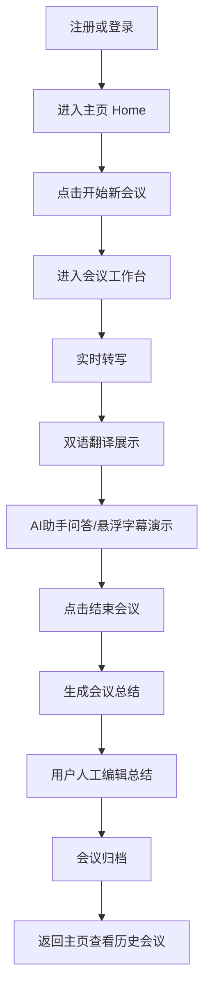

# MVP 产品 POC 模块与用户流转

> 版本：v0.1
> 目的：用于统一当前智能会议系统 POC 的产品范围、模块边界与最小可演示用户路径。

## 1. 文档定位

这份文档不讨论底层技术实现细节，也不追求完整商业化产品设计，而是服务于当前阶段的目标：

- 帮团队对齐：这次 POC 到底要做成什么样
- 帮产品梳理：用户在演示时会如何一步步使用系统
- 帮研发聚焦：哪些模块是 MVP 必做，哪些可以先不做
- 帮客户理解：这个系统在一次完整会议中的使用闭环是什么

当前建议将系统理解为一个围绕“单个操作者在单台电脑上发起并完成一次会议”的 MVP 产品。

## 2. MVP 的核心目标

本阶段不是做一个复杂的多人协同会议平台，而是先做一个**可看的、可讲清楚价值的智能会议闭环**。

MVP 只需要回答 3 个问题：

- 用户如何开始一场会议
- 用户在会议中能看到哪些 AI 能力
- 会议结束后内容如何沉淀、编辑和回看

因此，MVP 的最小闭环可以概括为：

`注册/登录 -> 开始会议 -> 会中转写/翻译/演示 AI -> 结束会议 -> 生成总结 -> 用户编辑 -> 会议归档 -> 返回历史会议查看`

## 3. MVP 一级模块

从用户流转角度，当前 POC 建议只抓 3 个一级模块。

### 3.1 会中工作台

这是用户最核心的使用场景，也是客户最容易感知价值的部分。

包含内容：

- 实时会议转写
- 双语翻译展示
- 悬浮字幕展示
- AI 助手问答
- 会中/会后总结展示入口

对应现有原型页面：

- `原型/index.html`

### 3.2 会议数据中心

这是整个系统“能不能形成闭环”的关键。没有数据沉淀，演示就只能停留在一个实时 Demo 页面。

包含内容：

- 会议创建与会议记录
- 会议结束后的总结结果
- 历史会议列表
- 会议回看与再次进入
- 后续导出或归档能力

对应现有原型页面：

- `原型/home.html`
- `原型/index.html`

### 3.3 账号与最小权限

当前阶段不建议一开始就做复杂组织协同，但至少要有“谁登录、谁看到自己的会议、谁能进入后台”的基础逻辑。

包含内容：

- 注册 / 登录
- 账号身份
- 会议归属
- 最小角色权限

建议 MVP 只保留两种角色：

- `普通用户`：发起会议、查看自己的会议、编辑自己的总结
- `管理员`：拥有普通用户能力，额外可查看组织配置页或演示管理能力

对应现有原型页面：

- `原型/home.html`
- `原型/admin.html`

## 4. 用户对象的 MVP 假设

为了让 POC 更容易成立，建议先统一以下产品假设。

- 一场会议默认由一个登录用户发起
- 一个会议默认挂在发起人的账号下
- 同一场会议里可以有多个说话人，但不等于多个用户同时在线操作系统
- 演示时可以只有一个操作者，但会议内容中体现多个参会人
- 暂时不把“多人在线协同编辑”“多人同时登录观看同一会议”作为 MVP 必做能力

这组假设非常重要，因为它能显著降低产品和研发复杂度，同时不影响客户理解系统价值。

## 5. MVP 主用户流转

下面这条路径，是当前最适合演示的最小完整闭环。

### 5.1 会前阶段

用户首次进入系统，完成基础身份进入动作。

- 注册账号或由管理员分配测试账号
- 登录系统
- 进入主页
- 在主页看到“开始新会议”入口

这一阶段的核心目标不是展示复杂注册流程，而是让用户顺利进入系统主界面。

### 5.2 开始会议

用户从主页进入本次会议工作台。

- 点击“开始新会议”
- 进入会议工作区
- 系统开始接收音频流
- 页面进入“实时转写中”状态

这里是从“系统入口”切换到“核心价值展示区”的关键一步。

### 5.3 会中演示

这是整个 POC 最重要的展示段落，建议围绕 4 件事展开。

- 实时转写不断出现
- 翻译结果同步显示
- 用户可打开悬浮字幕或切换显示模式
- 用户可向 AI 助手发问，得到基于本场会议内容的回答

如果需要客户快速理解价值，建议演示顺序为：

1. 先看实时转写
2. 再看双语翻译
3. 再展示 AI 助手
4. 最后补充悬浮字幕

这样用户认知负担最小。

### 5.4 结束会议

会议结束时，系统从“实时处理中”切换到“结果沉淀”阶段。

- 用户点击结束会议
- 系统停止接收实时内容
- 系统生成本场会议总结
- 页面切换或进入“会议总结”视图

这一阶段的核心不是“结束按钮”本身，而是让用户感受到系统已经把会中内容沉淀成结构化结果。

### 5.5 会后编辑

会后编辑是 POC 中很重要的一步，因为它说明系统不是黑盒自动生成，而是支持人工掌控结果。

- 用户查看 AI 总结
- 用户修改摘要、关键结论、待办等内容
- 用户确认本次会议结果
- 用户可选择导出或暂存

这一环节特别适合体现“AI 生成 + 人工确认”的产品逻辑。

### 5.6 归档与回看

当会议处理完成后，用户回到主页或历史会议页。

- 会议进入历史列表
- 用户在主页看到本次会议记录
- 用户未来可以再次进入查看

至此，一个完整会议闭环结束。

## 6. MVP 用户流转图

## 7. 适合演示的最小产品路径

如果从客户演示逻辑出发，建议把 MVP 路径压缩成下面这一条。

### 主路径

- 登录系统
- 进入主页
- 开始新会议
- 展示实时转写
- 展示双语翻译
- 展示 AI 助手问答
- 结束会议
- 展示自动总结
- 人工编辑总结
- 回到主页查看归档会议

### 辅助分支

以下内容可以作为加分项演示，但不一定要在首次MVP版本中纳入主链路。

- 打开悬浮字幕
- 展示术语库会影响翻译表现
- 展示管理员账号可进入组织管理页
- 展示历史会议回看

## 8. 当前不建议纳入 MVP 主链路的内容

为了保持 POC 聚焦，以下内容建议先不放入“主用户流转”。

- 多人同时在线操作同一场会议
- 复杂的组织协同与共享权限
- 复杂邀请机制
- 声纹库完整闭环
- 企业术语库的精细化权限控制
- 多端同步
- 会中复杂人工编辑

这些能力未来都可以扩展，但不应该影响第一版产品闭环成立。

## 9. 面向研发的最小落地理解

如果要把上面的用户流转映射成开发任务，MVP 只需要先保证以下 5 件事成立：

- 用户能登录并进入主页
- 用户能发起一场会议
- 会议页面能实时展示转写与翻译结果
- 会议结束后能生成并展示总结
- 会议结果能保存并在主页再次看到

只要这 5 件事跑通，POC 就已经具备“完整可演示产品”的基本形态。

## 10. 一句话结论

当前智能会议系统 MVP 的本质，不是做全量复杂会议平台，而是做一条清晰的最小闭环：

`用户进入系统 -> 发起会议 -> 看见 AI 会中能力 -> 结束会议 -> 编辑并沉淀结果 -> 在历史会议中再次找到这场会议`

这条路径一旦跑通，产品逻辑就成立了。
