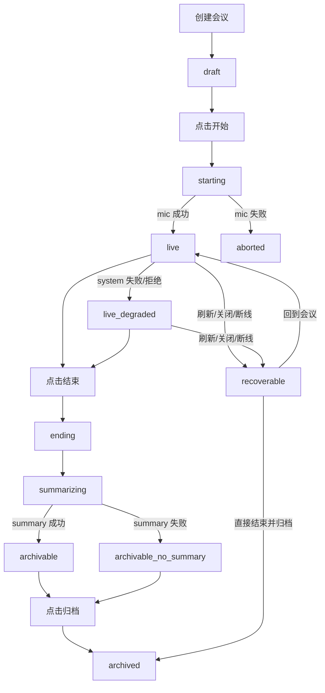

# 会议状态机与容错修复基线方案

> 版本：v0.1  
> 日期：2026-07-02  
> 说明：本文档用于沉淀当前阶段已经确认的会议页状态机、容错边界、页面承接规则与修复顺序，作为后续逐步开发、联调和验收的统一基线。  
> 当前范围：**只落文档，不修改代码实现**。

## 一、文档目标

本轮已明确，当前会议页问题并不是单一 Bug，而是以下几类问题叠加：

- 浏览器本地配置与登录用户边界不清
- 系统音频链路与主链路错误隔离不彻底
- 会议结束、总结生成、归档之间缺少正式状态承接
- 异常关闭、刷新、断线后没有业务终态写回
- `processing` 中间态已进入实现，但产品层没有正式定义和页面承接

因此，本文档目标不是只修一个点，而是先固定一套统一口径：

1. 会议生命周期怎么定义
2. 哪些状态是正式状态，哪些状态必须废弃
3. `Home / Meeting / Replay / Login-Logout` 各自如何承接状态
4. `Key` 如何按用户隔离
5. 系统音频错误边界应如何收敛
6. 后续开发应按什么顺序进行
7. 最终按什么清单验收

后续所有开发，应以本文档为准推进。如果中途有方向调整，应先更新本文档，再改实现。

---

## 二、当前已确认的产品结论

### 2.1 Key 策略

已确认采用：

- **按用户绑定的会话级 Key**

具体口径如下：

- 用户登录后，第一次输入 Key，可保存在本地
- 同一用户在当前登录阶段内，进入不同会议页不需要重复输入 Key
- 用户退出登录时，必须删除该用户对应的 Key
- 切换账号后，不能看到上一个账号的 Key

当前阶段不采用：

- 全局浏览器唯一 Key
- 脱离登录用户长期残留的 Key
- 完全跟服务走的后端托管 Key

后续如果产品化升级，可再演进到：

- 前端不持有真实 Key
- 登录后从本地服务或后端获取临时会话 Token

但在当前阶段，先做“按用户绑定的会话级 Key”最合适。

### 2.2 系统音频产品形态

当前阶段产品形态保持不变：

- 点击“开始会议”后，系统默认尝试接入系统音频
- 不额外增加“是否启用系统音”的前置选择开关

原因：

- 当前产品预期客户会接入其他会议系统
- 系统音是会议体验中的重要增强能力
- 当前优先级是修正错误边界，而不是改变交互形态

但已明确要求：

- `getDisplayMedia()` 失败不能改坏整场会议状态
- `system` 路启动失败不能走全局 `handleError()`
- `system` 路失败后，用户仍然能继续：
  - 转写
  - 结束会议
  - 生成总结
  - 执行归档

也就是说：

- **产品形态可以先不改**
- **错误边界必须重做**

### 2.3 后续开发方式

已确认后续按以下方式推进：

- 先落基线文档
- 再按修复顺序分阶段开发
- 最后按验收清单统一验收

本轮仅完成第一步：

- **文档落档**

---

## 三、当前问题的统一判断

### 3.1 当前问题不是单点问题

当前会议页问题不是单一权限问题，也不是单一存储问题，而是多点叠加：

- 浏览器本地存储把配置和用户生命周期绑乱了
- 系统音链路本应是增强项，但仍可能污染主链路状态
- “结束会议”和“真正归档”之间没有完整的状态承接
- 总结生成被做成归档前置，导致归档链路脆弱
- 页面关闭/刷新只做资源清理，没有业务收尾

### 3.2 当前最致命的四个问题

本轮已明确，下面四个问题最致命：

1. **缺“会议结束但待归档”的正式状态承接**  
   当前实现里的 `processing` 已经在代码中存在，但没有产品定义、没有页面入口、没有统一恢复策略。

2. **缺“异常后强制收尾”路径**  
   一旦会议进入 `error`，用户反而更难正常结束会议。

3. **缺“无总结也能安全落盘”的兜底策略**  
   当前 summary 事实上成了归档单点依赖。

4. **缺“页面关闭/刷新”的业务终态写回**  
   当前只有资源 `cleanup`，没有业务状态 `closing / recoverable / archivable` 的写回。

### 3.3 为什么 `processing` 必须废弃

`processing` 目前的问题不是“这个词不好”，而是：

- 它是代码里私自增加的持久化状态
- 产品文档没有定义它
- Home 不把它当进行中会议
- Home 也不把它当历史会议
- Replay 不允许它进入回看

结果就是：

- 用户结束会议后，如果没走完整归档流程，这场会议会落入“系统里存在、但页面没有入口”的悬空态

因此：

- `processing` 不是一个合格的产品状态
- 后续必须用更明确的正式状态替代它

---

## 四、统一设计目标

后续修复的总目标收敛为三条：

1. **Key 按用户隔离，登录内可复用，退出即清**
2. **system 路彻底降级化，任何失败都不能拖垮整场会议**
3. **会议必须总能走到“可恢复”或“可归档”，不能再出现首页无入口的悬空态**

换句话说：

- 用户永远找得到那场会议
- 用户永远有办法把那场会议安全收尾

---

## 五、理想状态机总览



该状态机表达的是：

- 先把“主状态”拉直
- 再把“总结成功/失败”“系统音成功/失败”收敛为子状态或分支
- 任何异常都不能把会议带到无入口状态

---

## 六、正式状态定义

### 6.1 主状态列表

后续统一使用以下主状态：

- `draft`
- `starting`
- `live`
- `live_degraded`
- `ending`
- `summarizing`
- `archivable`
- `archivable_no_summary`
- `archived`
- `recoverable`
- `aborted`

### 6.2 每个主状态的定义

#### `draft`

定义：

- 会议记录已创建，但尚未真正开会

场景：

- Home 发起新会议后
- 用户还没点击开始会议

#### `starting`

定义：

- 用户已点击开始，系统正在申请权限、建链、准备进入正式会议

场景：

- 校验 Key
- 拉起麦克风权限
- 尝试接入系统音
- 建立 WebSocket 主链路

#### `live`

定义：

- 麦克风主链路正常，会议进行中

说明：

- 这是整场会议的标准会中态

#### `live_degraded`

定义：

- 会议继续进行，但系统音不可用，仅剩麦克风主链路

说明：

- 这是降级后的会中态
- 仍属于“正常可继续”的会议态

#### `ending`

定义：

- 用户已点击结束，系统正在停采集、停任务、做收尾

说明：

- 即使有一路关闭失败，也不能留在原状态
- 必须继续收尾

#### `summarizing`

定义：

- 正在生成最终总结

说明：

- 这是结束之后、归档之前的正式中间态
- 它是 `processing` 的正式替代方案之一

#### `archivable`

定义：

- 最终总结已成功，可执行归档

说明：

- 这是“待归档但总结已成功”的状态

#### `archivable_no_summary`

定义：

- 总结失败或为空，但会议内容已足够落盘，仍允许归档

说明：

- 这是关键兜底态
- 防止 summary 变成归档单点依赖

#### `archived`

定义：

- 会议最终归档完成

说明：

- Home 历史卡片可见
- Replay 可读

#### `recoverable`

定义：

- 会议因关闭页面、刷新、崩溃、掉线等原因中断，但仍应提供恢复入口

说明：

- 这是异常会话的正式承接态

#### `aborted`

定义：

- 会议尚未真正开始即失败，不进入历史归档

说明：

- 例如麦克风主链路没有成功建立

---

## 七、状态字段定义表

建议后续把“主状态”和“子状态”拆开。

| 字段 | 类型 | 建议值 | 作用 |
|---|---|---|---|
| `status` | 主状态 | `draft` `starting` `live` `live_degraded` `ending` `summarizing` `archivable` `archivable_no_summary` `archived` `recoverable` `aborted` | 唯一主页面承接状态 |
| `summaryStatus` | 子状态 | `empty` `loading` `ready` `failed` | 控制总结区与归档条件 |
| `audioMode` | 子状态 | `mic_only` `mic_plus_system` | 控制会中提示与埋点 |
| `systemAudioStatus` | 子状态 | `pending` `connected` `denied` `no_track` `failed` `ended` `not_requested` | 描述系统音增强链路 |
| `micStatus` | 子状态 | `idle` `connecting` `live` `failed` `ended` | 描述主链路状态 |
| `closeReason` | 结束原因 | `normal_stop` `mic_failed` `network_lost` `browser_closed` `refresh` `manual_abort` `system_only_failed` | 诊断与恢复判断 |
| `lastActiveAt` | 时间戳 | ISO string | Home 排序、恢复入口 |
| `startedAt` | 时间戳 | ISO string / null | 会议真正开始时间 |
| `endedAt` | 时间戳 | ISO string / null | 归档时间 |
| `archiveReadyAt` | 时间戳 | ISO string / null | 进入可归档态时间 |
| `summaryLastAttemptAt` | 时间戳 | ISO string / null | 总结失败重试判断 |
| `ownerUserId` | 用户归属 | userId | 数据隔离 |
| `configOwnerUserId` | 配置归属 | userId | 校验配置没有串号 |

---

## 八、Key 存储与用户边界规则

### 8.1 目标口径

会议配置不再使用一个脱离用户的全局存储结构。

改为：

- **按用户隔离的会议配置**

### 8.2 基本规则

- 登录后，按 `currentUser.id` 读取该用户自己的会议配置
- 配置中可包含：
  - `apiKey`
  - `translatorModel`
  - `mainLanguage`
  - `meetingTargetLanguage`
  - `silenceDuration`
  - `minSpeechDuration`
- 同一用户本次登录期间可复用配置
- 退出登录时删除该用户对应配置，至少删除 `apiKey`
- 切换账号后不得看到上一个用户的配置

### 8.3 建议存储结构

建议 key 形式：

- `audio-claw-meeting-config:<userId>`

建议 value 结构：

```json
{
  "userId": "u_member_001",
  "apiKey": "xxx",
  "translatorModel": "senseaudio-s2-lite",
  "mainLanguage": "zh",
  "meetingTargetLanguage": "en",
  "silenceDuration": "500",
  "minSpeechDuration": "300",
  "updatedAt": "2026-07-02T10:00:00.000Z"
}
```

### 8.4 防串号规则

必须增加以下校验：

- 如果配置中的 `userId` 与当前登录用户不一致，直接丢弃
- 不允许回填跨用户配置
- 不允许退出登录后继续保留上一个用户的 `apiKey`

---

## 九、系统音错误边界重定义

### 9.1 核心原则

系统音是增强链路，不是主链路。

因此：

- 主链路 = 麦克风
- 增强链路 = 系统音

结论：

- 只有 `mic` 路能决定整场会议是否真正开始
- 只有 `mic` 路能决定整场会议是否进入“主失败”
- `system` 路失败只能触发降级，不得触发整场错误态

### 9.2 系统音失败后的正确行为

以下场景都只应触发降级：

- `getDisplayMedia()` 被拒绝
- 用户未共享音频
- 系统音轨为空
- `system` channel 启动失败
- 系统音中途断开

正确行为：

- 会议继续
- 麦克风继续上传和出字
- 会中允许继续结束会议
- 会后允许继续总结与归档
- 页面提示“系统音不可用，已降级为仅麦克风”

### 9.3 全局错误处理边界

后续必须明确：

- `system` 路错误不能再直接走全局 `handleError()`
- 全局 `handleError()` 只处理：
  - 麦克风主链路错误
  - 页面级不可恢复错误

### 9.4 系统音专属处理器职责

系统音专属错误处理器至少要做：

1. 更新 `systemAudioStatus`
2. 更新 `audioMode = mic_only`
3. 将主状态保持在：
   - `live`
   - 或 `live_degraded`
4. 更新提示文案
5. 保持以下能力可继续：
   - 结束会议
   - 生成总结
   - 归档

---

## 十、页面承接规则

### 10.1 Login / Logout

#### 登录后

- 读取当前用户专属配置
- 仅回填当前用户自己的会议配置

#### 退出登录时

- 删除当前用户对应的会议配置 key
- 至少删除该用户的 `apiKey`

### 10.2 Home 页承接规则

#### `draft`

- 默认不展示为历史会议
- 可选显示“待开始会议”

#### `starting`

- 归入“待恢复/进行中”横幅
- 文案可显示“正在启动会议”

#### `live`

- 归入“回到会议”横幅

#### `live_degraded`

- 归入“回到会议”横幅
- 文案显示“当前仅麦克风模式”

#### `ending`

- 归入“进行中/待恢复”横幅
- 文案显示“正在结束会议”

#### `summarizing`

- 归入“待归档/处理中”横幅
- 文案显示“正在生成最终总结”

#### `archivable`

- 显示“待归档会议”横幅
- 点击后应直接进入总结页

#### `archivable_no_summary`

- 显示“总结失败，仍可归档”的待归档横幅
- 点击后进入总结页

#### `recoverable`

- 显示“恢复上次会议”横幅

#### `archived`

- 显示在历史会议卡片区域

#### `aborted`

- 不进入历史会议
- 可选保留调试记录，但不应污染主界面

### 10.3 Meeting Live 页承接规则

允许进入 Meeting Live 页的状态：

- `draft`
- `starting`
- `live`
- `live_degraded`
- `ending`
- `summarizing`
- `archivable`
- `archivable_no_summary`
- `recoverable`

规则如下：

- `recoverable` 进入后优先提示“恢复会议”
- `archivable` / `archivable_no_summary` 进入后默认落在总结页
- `archived` 不应走 live 页继续录制逻辑

### 10.4 Replay 页承接规则

Replay 只允许一个状态：

- `archived`

以下状态都不允许进入 Replay：

- `draft`
- `starting`
- `live`
- `live_degraded`
- `ending`
- `summarizing`
- `archivable`
- `archivable_no_summary`
- `recoverable`
- `aborted`

其中：

- `archivable` / `archivable_no_summary` 应回到 Meeting 页
- `recoverable` 应走“恢复会议”

---

## 十一、关键判断节点

### 11.1 创建会议

判断：

- 用户是否已登录

成功后：

- 状态写为 `draft`

明确要求：

- 不再直接写成 `ongoing`

### 11.2 点击开始

判断：

- 当前状态必须是：
  - `draft`
  - 或 `recoverable`

成功后：

- 先切 `starting`

要求：

- 这一刻就要持久化状态
- 避免刷新后完全失去上下文

### 11.3 麦克风权限

判断：

- 这是唯一的主失败点

成功：

- 进入 `live`

失败：

- 进入 `aborted`
- 给出“重新开始会议”能力

### 11.4 系统音权限

判断：

- 默认尝试申请
- 但只影响增强链路

成功：

- `audioMode = mic_plus_system`
- `systemAudioStatus = connected`

失败：

- 进入 `live_degraded`
- `audioMode = mic_only`

明确要求：

- 禁止 system 失败后把主状态打成整场 `error`

### 11.5 会中掉线

判断：

- 掉的是 `mic` 还是 `system`

规则：

- `system` 掉线：`live -> live_degraded`
- `mic` 掉线：`live / live_degraded -> recoverable`

### 11.6 点击结束

判断：

- 以下状态都允许“强制结束并收尾”：
  - `live`
  - `live_degraded`
  - `recoverable`

成功后：

- 进入 `ending`

要求：

- 即使某一路关闭失败，也必须继续收尾
- 不能让用户卡死在按钮禁用状态

### 11.7 自动总结

判断：

- 只要会议中已有可用 transcript，就尝试生成最终总结

成功：

- `summarizing -> archivable`

失败：

- `summarizing -> archivable_no_summary`

明确要求：

- summary 失败不能阻止归档

### 11.8 点击归档

判断：

- `archivable`
- `archivable_no_summary`

两者都允许归档。

归档后：

- 进入 `archived`
- 写入：
  - `endedAt`
  - `durationSeconds`
  - 最终 transcript
  - summary（如有）

### 11.9 页面关闭 / 刷新 / 崩溃

判断：

- 如果当前处于以下状态，不能只做资源 cleanup：
  - `starting`
  - `live`
  - `live_degraded`
  - `ending`
  - `summarizing`

要求：

- 必须写业务终态

建议：

- `starting` 关闭：`recoverable` 或 `aborted`
- `live / live_degraded` 关闭：`recoverable`
- `ending / summarizing` 关闭：`archivable_no_summary` 或 `recoverable`

原则：

- 绝不允许再次落入“无入口悬空态”

---

## 十二、旧状态迁移规则

为了兼容当前本地已有数据，必须定义旧状态迁移规则。

| 旧状态 | 迁移条件 | 新状态 |
|---|---|---|
| `ongoing` | `startedAt` 为空或无实际会中数据 | `draft` |
| `ongoing` | 有会中数据且未结束 | `recoverable` |
| `processing` | `summaryStatus = ready` | `archivable` |
| `processing` | `summaryStatus != ready` | `archivable_no_summary` |
| `finished` | 已有最终归档内容 | `archived` |

迁移目标：

- 不打断当前已有演示数据
- 让旧数据进入新的正式状态体系
- 避免继续沿用 `processing`

---

## 十三、修复顺序

后续开发顺序确认如下：

### 第一阶段：状态与存储收口

目标：

- 先让数据模型不再自相矛盾

主要动作：

- 去掉 `processing`
- 引入新的正式主状态
- 做旧数据迁移
- 按用户隔离 Key

完成标准：

- Home 不再出现无入口会议
- 切换账号不串 Key

### 第二阶段：启动与错误边界重做

目标：

- 让 system 失败不再污染主链路

主要动作：

- 拆分 `mic` 与 `system` 错误处理
- `system` 错误不再走全局 `handleError()`
- `stopMeeting()` 支持强制收尾
- `error` 后仍可结束

完成标准：

- 拒绝系统音、系统音中途断开、system 建链失败三种场景下，会议仍能结束和归档

### 第三阶段：总结与归档兜底

目标：

- 让 summary 不再是归档单点依赖

主要动作：

- 增加 `archivable_no_summary`
- 结束后自动进入总结态
- summary 失败时允许直接归档

完成标准：

- 无 transcript、少量 transcript、summary 失败场景下都不会卡死

### 第四阶段：页面关闭与恢复入口

目标：

- 刷新、关页、崩溃后仍有业务闭环

主要动作：

- `beforeunload / pagehide` 写业务终态
- Home 增加“恢复会议 / 待归档会议”横幅

完成标准：

- 关闭浏览器重进后，用户能明确看到“恢复”或“归档”入口

---

## 十四、优先级

### P0

- 按用户隔离 Key
- 移除 `processing`
- 建立正式状态承接
- system 错误不再走全局 `handleError()`
- `error` 后仍可强制结束
- summary 失败仍可归档

### P1

- Home 恢复入口
- Home 待归档入口
- 页面关闭 / 刷新业务终态写回

### P2

- 更细的恢复提示
- 更细的失败原因提示
- 更友好的重试按钮和恢复引导

---

## 十五、最小验收清单

后续统一按以下清单验收：

1. 同一账号登录后输入一次 Key，再进会议无需重输
2. 退出登录后，该账号 Key 被清掉
3. 切换账号后，看不到前一个账号的 Key
4. 拒绝系统音后，仍能继续出字
5. system 路启动失败后，仍能结束会议
6. system 路中途断开后，仍能生成总结
7. summary 失败后，仍能归档
8. 关闭浏览器后，再进 Home 能看到恢复或待归档入口
9. 不再存在首页不可见、Replay 不可进、又删不掉的悬空会议

---

## 十六、实施口径补充

### 16.1 当前阶段不追求的点

当前第一版修复，不要求一步做到：

- 完美恢复正在进行的实时连接
- 完整重连并继续原来的音频采集流
- 后端托管 Key
- 完整服务端持久化托底

### 16.2 当前第一版最关键的目标

第一版只要先做到以下两点，就已经是非常大的产品改善：

1. 用户永远找得到那场会议
2. 用户永远有办法把那场会议安全收尾

---

## 十七、最终结论

本次基线确认后，后续开发统一按以下原则执行：

- `Key`：按用户绑定，登录内可复用，退出即清
- 主链路：只有 `mic` 能决定会议生死
- 系统音：只影响增强状态，不影响结束、总结、归档
- 结束：必须永远可达
- 归档：必须不依赖 summary 成功
- 关闭页面：必须留下可恢复或可归档入口

同时明确：

- `processing` 废弃
- 状态机重构为正式可承接体系
- 后续按本文档所列修复顺序逐步实现
- 最终按本文档验收清单完成验收

本文档即作为后续会议页状态机与容错修复的统一基线。
