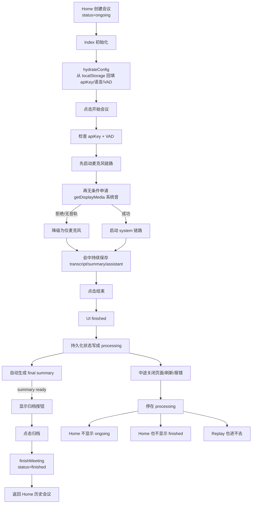

# 会议页系统音频权限拒绝降级问题排查与方案

> 版本：v0.1\
> 说明：本文档只记录问题判断、接口链路理解与建议方案；**本轮不修改代码实现**。

## 一、问题描述

当前会议页支持两路音频来源：

- 麦克风音频
- 系统/屏幕共享音频

产品目标本来是：

- 麦克风是主链路，必须保证可用
- 系统音频是增强链路，可选接入
- 用户如果没有共享屏幕、没有勾选“共享音频”，或者主动关闭系统音频授权，会议仍应继续进行，并自动退回为“仅麦克风转写”

但这次运行时排查里出现了一个风险现象：

- 页面能成功进入 `connected_success`
- `task_start` 也已成功
- 但随后会议页进入 `Permission denied / NotAllowedError`
- 页面最终回落到“识别异常”
- 页面没有持续产生 transcript 结果

从用户视角看，这会被理解成：

- “开始会议后没字”
- “一旦我取消共享页面/系统声音，整场会议就坏了”

这和我们原本的产品预期不一致。

## 二、当前实现逻辑

当前会议页启动时，主流程位于：

- `src/meeting/meeting-page-app.js`

相关链路大致如下：

1. 点击“开始会议”
2. 先建立 `mic` 这一路的实时链路
3. `mic` 成功后，再调用 `navigator.mediaDevices.getDisplayMedia(...)` 申请屏幕共享与系统音频
4. 如果拿到了系统音频轨，就再补建一路 `system` channel
5. 如果没拿到系统音频轨，理论上应直接退回“仅麦克风转写”

对应代码中的关键意图其实已经存在：

- 先起麦克风，再申请系统音频\
  见 `src/meeting/meeting-page-app.js`
- 如果系统音频流申请失败，设为 `null`
- 如果 `systemStream` 没有音频轨，主动停止该流并降级
- 如果系统音频链路启动失败，文案写为“系统声音路接入失败，已降级为仅麦克风转写。”
- 如果根本没有捕获到系统声音，文案写为“未捕获到系统声音，本场仅转写麦克风。”

也就是说，**当前代码在产品设计意图上，已经是“系统音频失败时应降级”**，这一点没有问题。

## 三、当前问题的核心判断

这次问题不应再优先归因为：

- 官方 API 不可用
- WebSocket 鉴权彻底失效
- 页面完全命中旧缓存

因为运行时已经验证到：

- HTTP 模型链路可用
- ASR WebSocket 可用
- 会议页可进入 `connected_success`
- 会议页可进入 `task_started`

因此，本次更像是：

- **系统音频申请/媒体权限这一步的异常，被错误地扩大影响到了整场会议主链路**

也就是说：

- 在产品层面，系统音频本该是“可选增强”
- 但在当前运行态里，它有机会把会议整体拖入错误态

这正是需要修正的点。

## 四、问题根因的产品化理解

从产品逻辑出发，这里应该明确一个原则：

- **会议主链路 = 麦克风**
- **系统音频 = 可选增强，不得反向影响主链路**

所以只要用户以下任一情况发生：

- 关闭共享屏幕弹窗
- 不勾选“共享音频”
- 浏览器拒绝系统声音权限
- 系统音频轨为空
- 后续系统音频轨中断

都不应该导致：

- 整场会议失败
- 主按钮从“会议中”回退为“重新连接”
- 转写状态直接变成“识别异常”

正确表现应该是：

- 会议继续保持进行中
- 麦克风链路继续上传和出字
- 只把系统音频标记为未接入或已降级

## 五、接口逻辑上应如何修正

这次问题的重点不是 UI 文案，而是接口链路责任边界。

建议把责任边界明确成下面这样：

### 1. 麦克风链路是唯一的“会议主链路”

也就是：

- `startMeeting()` 的成功与否，首先只应由 `mic` channel 决定
- 只要 `mic` 建链成功并开始采集，会议就应进入“会议中 / 转写中”

### 2. 系统音频链路是“附加链路”

也就是：

- `getDisplayMedia(...)` 失败，不应让整场会议失败
- `systemStream` 无音频轨，不应让整场会议失败
- `system` channel 启动失败，不应让整场会议失败

它只应该影响：

- 页面提示文案
- 是否额外接入远端/本机声音

而不应该影响：

- 主会议状态
- 麦克风转写状态
- transcript 落字能力

### 3. 主错误态只能由麦克风链路触发

这条原则当前代码里已经有一部分体现：

- `system` 路掉线时，仅停止该路并提示“继续转写麦克风”
- `mic` 路掉线时，才视为整场断连

但这个原则还应继续前移到“系统音频申请与启动阶段”：

- 如果 `getDisplayMedia` 被拒绝
- 或 `system` channel 在启动阶段报权限错误

都应在 `system` 路内部吃掉并降级，而不是向上冒泡到整场会议失败逻辑。

## 六、建议方案

建议方案不是“去强求用户共享音频”，而是“把共享音频做成真正的可选增强项”。

### 方案目标

- 用户共享系统音频：正常双路转写
- 用户拒绝系统音频：自动降级到仅麦克风
- 用户只共享画面不共享声音：自动降级到仅麦克风
- 系统音频中途断开：继续麦克风转写，不中断会议

### 方案口径

建议统一为：

- 麦克风必须工作
- 系统音频尽力接入
- 系统音频失败时只影响增强能力，不影响会议主链路

### 建议改动点

1. `getDisplayMedia(...)` 拒绝时\
   不上抛整场错误，只记录并显示“仅麦克风模式”
2. `systemStream` 没有音频轨时\
   直接销毁该流，继续 `mic`
3. `system` channel 启动失败时\
   仅停止该路，保留 `mic`
4. 任何由系统音频引起的 `NotAllowedError / Permission denied`\
   都应映射为“系统音频不可用”，而不是“识别异常”
5. 全局会议状态的驱动源应继续收敛为 `mic`

## 七、建议的状态文案逻辑

产品表现上建议区分两类状态：

### A. 主链路异常

只在以下情况出现：

- 麦克风权限被拒
- 麦克风采集失败
- 麦克风对应的实时链路断开

这时才显示：

- “识别异常”
- “重新连接”

### B. 增强链路异常

只在以下情况出现：

- 系统音频未授权
- 未勾选共享音频
- 系统音频轨为空
- 系统音频中途断开

这时应该显示：

- “未捕获到系统声音，本场仅转写麦克风”
- “系统声音路接入失败，已降级为仅麦克风转写”
- “系统声音路已断开，继续转写麦克风”

但主按钮和转写主状态不应退化为错误态。

## 八、验证要点

如果后续按本方案修正，建议至少验证以下 5 种场景：

1. 允许麦克风，拒绝共享屏幕\
   预期：仅麦克风转写，会议正常进行
2. 允许共享屏幕，但不勾选共享音频\
   预期：仅麦克风转写，会议正常进行
3. 允许共享屏幕和共享音频\
   预期：麦克风 + 系统音频双路接入
4. 开会中途关闭共享屏幕\
   预期：系统音频断开，但麦克风继续转写
5. 麦克风权限被拒\
   预期：整场会议进入错误态，这是唯一合理的“主失败”

## 九、当前结论

本次问题的本质不是“用户没有共享系统音频”，而是：

- **系统音频链路虽然是可选项，但当前实现里仍有机会把整场会议拖入失败态**

因此后续真正要修的，不是让用户“必须共享声音”，而是：

- 把系统音频链路彻底做成“失败可降级、不会影响主链路”的结构

这也更符合当前 MVP 的产品目标：

- 先保证会议一定能靠麦克风跑起来
- 系统音频作为增强能力，尽量接，不强依赖

## 十、补充说明

本轮仅输出问题判断与方案文档，未修改任何代码实现。

 

