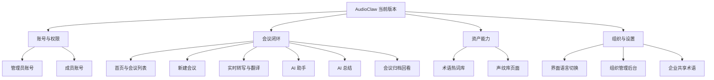
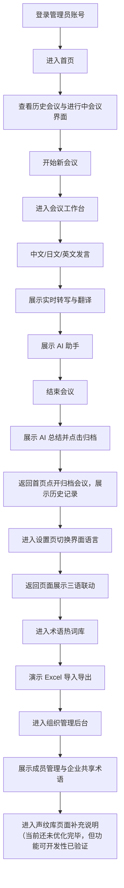

# AudioClaw 当前版本产品架构与演示路线

## 1. MVP介绍

AudioClaw 当前版本是一套浏览器端 AI 会议系统，已完成登录进入、首页与会议列表、发起会议、会中实时转写与翻译、AI 助手、AI 总结、术语导入导出、管理员后台、多语言界面切换的最小产品闭环。

当前演示重点：

- 会议主链路闭环
- 中日英三语界面与 AI 输出联动
- 术语热词库、管理员权限与企业共享资产

当前不作为主展示项：

- 声纹识别后续会与企业员工录入联动展示，这个在内部对接会已经展示过，功能是一样的，只是由于接入会导致会议流式不稳定还要看看能不能优化后再交付。
- 系统声音并行收音已完成可行性验证，也是效果问题，需要看看是不是还有优化方案，目前可以先给客户展示一版主要功能

下一步内部重点会继续推进系统内开另一个会 + 电脑同时收音并翻译的稳定并行能力，主要还是用于演示效果好、跑客户为主。

## 2. 产品架构图

## 3. 功能清单

| 模块      | 当前交付情况                         | 演示重点        |
| ------- | ------------------------------ | ----------- |
| 登录与账号   | 已完成管理员账号与成员账号登录                | 展示角色区分      |
| 首页与会议列表 | 已完成首页、历史会议、进行中会议入口             | 展示系统入口与会议沉淀 |
| 新建会议    | 已完成从首页进入会议工作台                  | 展示会议开始动作    |
| 实时转写与翻译 | 已完成会中原文与译文展示                   | 展示核心实时能力    |
| AI 助手   | 已完成基于当前会议内容提问与回答               | 展示会中问答能力    |
| AI 总结   | 已完成会议结束后的结构化总结                 | 展示会后沉淀能力    |
| 多语言界面   | 已完成中文、日文、英文切换                  | 展示界面国际化     |
| AI 语言联动 | 现在，会中AI助手与会后AI总结会自动跟随系统语言      | 展示语言一致性     |
| 悬浮字幕    | 已完成展示入口与会议联动                   | 可以脱离浏览器漂浮显示 |
| 术语热词库   | 已完成个人与企业共享两套视图、Excel 导入与导出     | 本轮不展开规则细节   |
| 组织管理后台  | 已完成成员管理与企业共享术语入口、管理员与普通员工权限分离  | 优先展示管理员权限   |
| 声纹库页面   | 已完成页面、隐私说明与数据权利入口，暂时还没真实接入声纹识别 | 轻量展示产品延展性   |

## 4. 用户演示流转逻辑

## 演示路线

### A. 主路线

1. 登录管理员账号
2. 进入首页
3. 开始新会议
4. 说中文、日文、英文短句
5. 展示实时转写与翻译
6. 展示 AI 助手
7. 结束会议并展示 AI 总结
8. 返回首页查看归档会议

### B. 辅路线（若时间不够，提前切换进日语界面展示主路线，其他几个页面点一下即可）

1. 进入设置页切换中文、日文、英文
2. 返回系统页面展示三语界面联动
3. 进入术语热词库演示 Excel 导入导出
4. 进入组织管理后台展示管理员权限
5. 进入声纹库页面补充后续规划

## 当前版本MVP口径与情况说明

- 已完成会议主链路闭环
- 已完成中日英三语界面与 AI 语言联动
- 已完成术语热词库导入导出、编辑增删改查、真实落入翻译场景
- 已完成管理员权限与企业共享资产入口
- 声纹识别后续会与企业员工录入一起推进
- 系统声音并行收音已完成可行性验证，结合声纹识别功能同时运行也已可行，但几个功能在单机/本机服务器/单API调用同开会稍微地拖慢界面效果，一方面还需要本周时间优化进当前演示链路里，另一方面后期看看产品化路径怎么解决效率问题。

